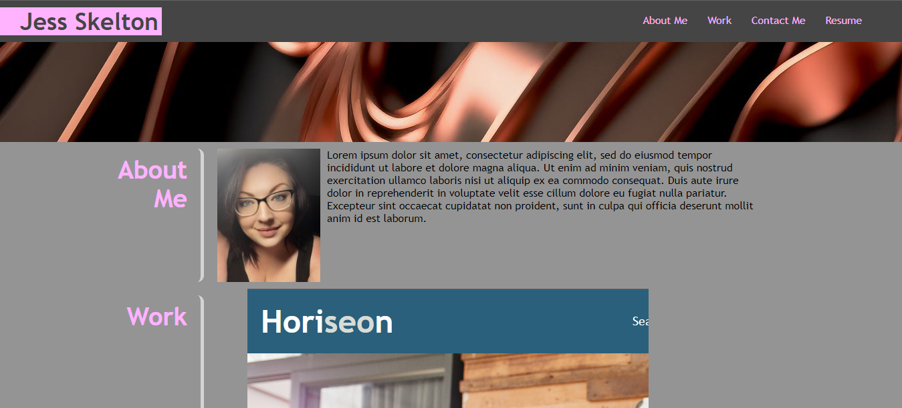

# portfolio-challenge

## Description
Challenge 2 -- Advanced CSS: Portfolio

This project was to build a portfolio for my self, which demonstrates my knowlege of advanced CSS, being flexbox, media queries, and accessibility. Through the process of creating this project, I learned much more about flexbox and how to use it with media queries to have the entire webpage with all it's elements strech and shrink depending on how someone is viewing the page and what kind of media screen they're using. I also learned more about CSS variables, and more about universal selectors.

## Usage

Screenshot of deployed application:

URL of deployed application: 
https://jskelly8.github.io/portfolio-challenge/

## Credits

README template used from: https://coding-boot-camp.github.io/full-stack/github/professional-readme-guide 
	edX Boot Camps LLC. (2022, October 27). Professional readme guide. Professional README Guide | The Full-Stack Blog. https://coding-boot-camp.github.io/full-stack/github/professional-readme-guide 

Hero/Banner Photo used from free-to-use photo library site:
Renders, Bango. (n.d.). Free stock photos from Bango Renders - StockSnap.io. StockSnap. Retrieved October 26, 2023, from https://stocksnap.io/author/bango3d

Help on flexbox layout & Image media screen queries from Boot Camp Tutor Team: Matthew Calimbas, see his work by visiting: https://github.com/MattyCalimbas